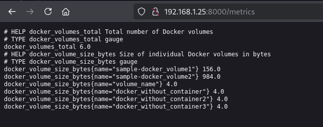

# Docker volume analyzer


Docker Volume Analyzer is a tool designed to simplify the management of Docker volumes. It provides features to:

- Visualize the containers associated with each volume.
- Explore the contents of volumes and delete files if needed.
- Retrieve basic information about volumes, such as size and usage.
- Streamline volume management tasks for improved efficiency.

This project aims to make Docker volume management more intuitive and user-friendly.

[](https://github.com/glefer/docker-volumes-analyzer/actions/workflows/main.yml)
[](https://codecov.io/gh/glefer/docker-volumes-analyzer)

[](https://hub.docker.com/r/glefer/docker-volumes-analyzer)

## Installation

### Prerequisites

- **Python** `>=3.13,<4.0.0`
- **Poetry** `>=2.1.2` installed globally ([installation link](https://python-poetry.org/docs/#installation))
- Docker installed locally (if you want to analyze volumes)

---

### 1. Clone the project

```bash
git clone https://github.com/glefer/docker-volumes-analyzer.git
cd docker-volumes-analyzer
```

### 2. Install dependencies

```bash
poetry install
```

### 3. Run the application

```bash
poetry run start
```

> ⚠️ The application uses the Docker socket at the standard location: `/var/run/docker.sock`

---

## 🐳 Usage via Docker 

Don't want to install Python? Simply use the Docker image:

```bash
docker run --rm -v /var/run/docker.sock:/var/run/docker.sock -ti glefer/docker-volumes-analyzer:latest
```

### Use a specific version

```bash
docker run --rm -v /var/run/docker.sock:/var/run/docker.sock -ti glefer/docker-volumes-analyzer:0.1.0
```

## Running the Application in Different Modes

The application supports multiple modes of operation. You can specify the mode using the `APP_MODE` environment variable. The available modes are:

- **CLI mode** (`start`): Runs the application in command-line interface mode.
- **Web development mode** (`web`): Starts the application in web development mode.
- **Gunicorn mode** (`gunicorn`): Runs the application using Gunicorn as the WSGI server.

### Using Docker
You can run the application in different modes by setting the `APP_MODE` environment variable when running the Docker container.

#### CLI mode
```bash
docker run --rm -e APP_MODE=start -v /var/run/docker.sock:/var/run/docker.sock -ti glefer/docker-volumes-analyzer:latest
```

#### Web development mode
```bash
docker run -e APP_MODE=web -v /var/run/docker.sock:/var/run/docker.sock glefer/docker-volumes-analyzer:latest
```

#### Web production mode (gunicorn)
```bash
docker run -e APP_MODE=gunicorn -v /var/run/docker.sock:/var/run/docker.sock glefer/docker-volumes-analyzer:latest
```

### Using python locally
If you prefer to run the application locally without Docker, you can use the entrypoint.sh script directly. Make sure you have all dependencies installed via Poetry.


#### CLI mode
```bash
APP_MODE=start scripts/entrypoint.sh
```

#### Web development mode
```bash
APP_MODE=web scripts/entrypoint.sh
```

#### Web production mode (gunicorn)
```bash
APP_MODE=gunicorn scripts/entrypoint.sh
```

## Prometheus

When running the application in **web** or **gunicorn** mode, it exposes a Prometheus metrics endpoint at `/metrics`. This endpoint provides detailed metrics about Docker volumes, such as:

- Total number of Docker volumes.
- Size of individual Docker volumes (in bytes).




For more information about the metrics exposed and how to integrate them with Prometheus, refer to the [Prometheus documentation](./doc/prometheus.md).

---

## Run tests

```bash
poetry run pytest
```

With coverage:

```bash
poetry run pytest --cov=docker_volume_analyzer
```

---

## 🛠 Development

Start a virtual shell:

```bash
poetry shell
```

Formatting and checks:
```bash
poetry run pre-commit run --all-files
```

---

## 🔧 Project structure

```
.
├── src/
│   └── docker_volume_analyzer/
│       └── main.py   # Entry point
├── tests/
├── README.md
├── pyproject.toml
└── poetry.lock
```

## Contributing

Contributions are welcome! If you'd like to contribute, please follow these steps:

1. Fork the repository.
2. Create a new branch (`git checkout -b feature/my-feature`).
3. Commit your changes (`git commit -m 'Add some feature'`).
4. Push to the branch (`git push origin feature/my-feature`).
5. Open a pull request.

For major changes, please open an issue first to discuss what you would like to change.

---

## 📝 License

This project is licensed under the **MIT** license — see the [LICENSE](./LICENSE) file.

---

## 👨‍💻 Author
[github.com/glefer](https://github.com/glefer)